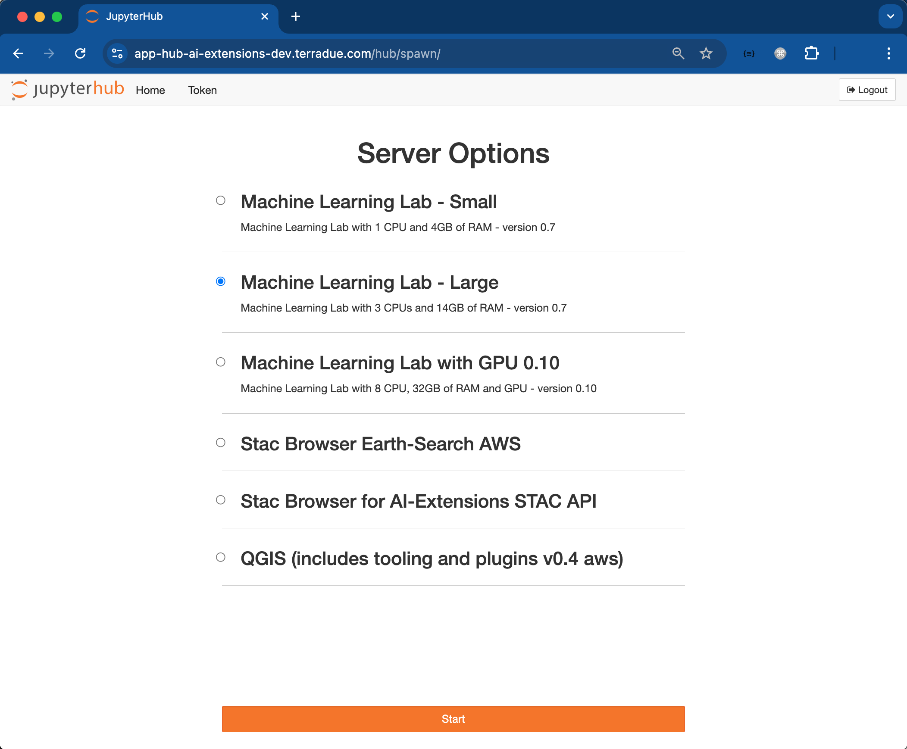

# JupyterHub
JupyterHub is a dedicated multi-user server that brings the power of JupyterLab to collaborative environments. It allows organizations to effortlessly deploy and manage Jupyter Notebook servers for multiple users, enabling seamless collaboration and resource sharing in data science and research settings. 

After login on your dedicated App Hub instance (e.g. [https://app-hub-ai-extensions-dev.terradue.com/](https://app-hub-ai-extensions-dev.terradue.com/)), you will be given the choice between different server options. These options are user-specific and depend on your registration profile settings. 

In the example shown below, seven server options are available: 

JupyterHub acts as a central platform, facilitating the launching and management of applications and providing a seamless and integrated experience for our users. Various web applications such as **MLflow**, **JupyterLab**, **Code Server** are managed and deployed within JupyterHub. 

JupyterHub can be launched by selecting either **Small** or **Large** servers, according to the resources needed by the user: 

* **Machine Learning Lab - Small**: server with 1 CPU and 4GB of RAM 
* **Machine Learning Lab - Large**: server with 3 CPU and 14GB of RAM

Other applications can be launched by selecting their dedicated instances and then clicking on `Start`.

* **Machine Learning Lab with GPU 0.10**
* **STAC Browser Earth-Search AWS**
* **STAC Browser for AI-Extensions STAC API**
* **QGIS (includes tooling and plugins v0.4 aws)**
