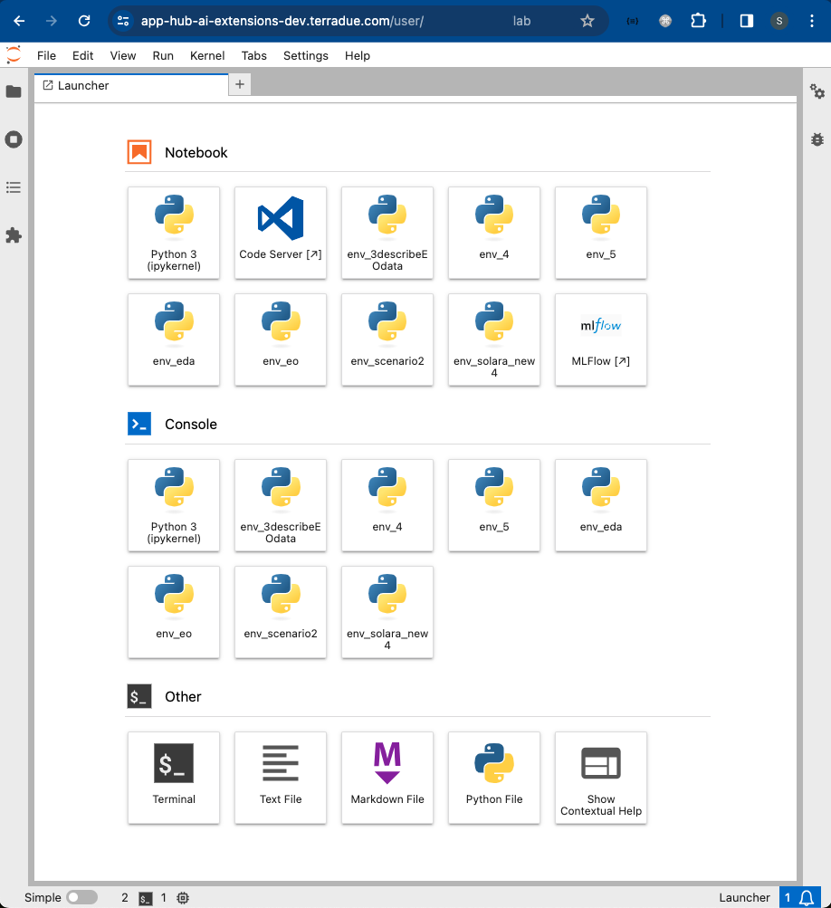

# JupyterLab

## Introduction
JupyterLab, serves as a powerful and flexible web-based Integrated Development Environment (IDE) for data analysis, model development, and interactive scientific computing. With JupyterLab, our users can write and execute code, visualise data, and create rich, interactive notebooks, enabling efficient experimentation and exploration of their data. With its flexible and extensible architecture, JupyterLab provides a seamless interface for data science workflows, allowing AI-users to explore, analyze, and collaborate on data-driven projects effortlessly. 

JupyterLab provides a flexible and powerful environment that supports AI-users in the implementation of the User Scenarios, enabling efficient exploration, prototyping, and development of ML models. The following outlines the specific ways in which JupyterLab is used within the service:

* Interactive Data Analysis: JupyterLab enables AI-users to perform interactive data analysis using Python and other programming languages. They can write and execute code in Jupyter notebooks, visualise data, and generate insights. This allows her to explore and understand the training data, perform statistical analysis, and gain valuable insights into the underlying patterns and trends.
* Model Development and Training: AI-users can leverage JupyterLab's capabilities to build and train ML models. They can use popular ML libraries such as `TensorFlow`, `PyTorch`, or `scikit-learn` to develop and experiment with different models. JupyterLab's interactive nature allows for iterative model development, parameter tuning, and real-time monitoring of training progress.
* Data Visualization: JupyterLab provides powerful data visualisation tools, allowing AI-users to create rich and interactive visualisations of her data and model outputs. They can generate plots, charts, and graphs to analyse model performance, understand feature importance, and communicate results effectively.
* Code Reusability and Collaboration: JupyterLab supports code reusability and collaboration among team members. AI-users can organise her code into reusable functions or modules, making it easier to maintain and share across different projects. JupyterLab also facilitates collaborative work, allowing multiple team members to work on the same notebooks simultaneously, comment on code, and provide feedback.
* Documentation and Reporting: JupyterLab's notebook format provides a powerful means of documenting and reporting ML experiments. AI-users can combine code, visualisations, and narrative text in a single document, making it easier to communicate and share her work with stakeholders. Notebooks can be exported in various formats, such as HTML or PDF, for easy dissemination.
* Integration with Data Science Libraries: JupyterLab seamlessly integrates with a wide range of data science libraries and frameworks, providing access to a rich ecosystem of tools and resources. AI-users can leverage these libraries to perform tasks such as data preprocessing, feature engineering, model evaluation, and more, enhancing her productivity and enabling faster development cycles.

By incorporating JupyterLab into the service, we empower AI-users with a versatile and user-friendly environment for data analysis, model development, visualisation, and collaboration. JupyterLab's interactive and flexible nature aligns perfectly with AI-users's scenarios, allowing her to leverage its capabilities to achieve her goals effectively.

## Starting JupyterLab
After loading up, the JupyterLab dashboard will appear. 

