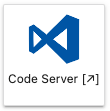

# Code Server

## Introduction
Code Server enables users to run Visual Studio Code (VS Code), a lightweight and versatile source code editor that combines the simplicity of a text editor with powerful developer tools, providing an intuitive and customizable environment for coding across various programming languages. With Code Server, VS Code and all its functionalities are available directly from the Application Hub server. 

Code Server extends the capabilities of JupyterLab by providing a cloud-based IDE with GPU resources that enables efficient coding, collaboration, and development of ML models. It enables AI-users to build, train, and test ML models using popular frameworks like `PyTorch` or `TensorFlow`. The GPU support enhances model training performance, allowing for faster iterations and improved productivity.

The following outlines the specific ways in which Code Server is used within the service:

*  Development Environment: Code Server provides a cloud-based development environment that eliminates the need for local installations and configurations. AI-users can access Code Server through a web browser, enabling her to work from any device with an internet connection. This flexibility allows her to work remotely, collaborate with team members, and access her projects and codebase from anywhere.
* Code Editing and Collaboration: Code Server offers a powerful code editing experience with features like syntax highlighting, code completion, and code navigation. AI-users can write, edit, and debug code in various programming languages, including Python, R, or Julia. Code Server also supports collaboration features, allowing multiple users to edit and work on the same codebase simultaneously, enabling efficient teamwork and knowledge sharing.
* ML Model Development: AI-users can leverage Code Server to develop ML models efficiently. They can use popular ML frameworks and libraries like `TensorFlow`, `PyTorch`, or `scikit-learn` to build, train, and evaluate models. Code Server's integrated terminal allows her to execute commands and run experiments seamlessly.
* Git Integration: Code Server integrates with Git, a version control system, enabling AI-users to manage her codebase effectively. They can perform Git operations such as cloning repositories, creating branches, committing changes, and pushing code to remote repositories directly from within Code Server. This integration facilitates code versioning, collaboration, and easy synchronisation with code hosting platforms like GitHub or GitLab.
* Extension Ecosystem: Code Server provides an extension ecosystem that allows AI-users to customise and enhance her development environment. They can install extensions for additional functionalities, such as linting, code formatting, code snippets, or ML-specific tools. This extensibility ensures that AI-users can tailor her coding environment to meet her specific needs and preferences.
* Integrated Terminal: Code Server includes an integrated terminal, enabling AI-users to execute command-line operations without leaving the IDE. They can run scripts, install dependencies, manage virtual environments, and perform various system-level tasks directly within Code Server. This seamless integration streamlines her workflow and eliminates the need for switching between different tools.

By incorporating Code Server into the service, we provide AI-users with a cloud-based IDE that supports her scenarios and enables efficient coding, collaboration, and ML model development. Code Server's accessibility, collaboration features, and integration with essential tools like Git make it an ideal choice for empowering AI-users to achieve her goals effectively.

## Starting Code Server
On the JupyterLab dashboard, click on the Code Server Logo.

The Code Server dashboard will appear.

You have access of all these functionalities from the vertical panel in the top-left corner of the dashboard:
* **Menu**: access functions and settings within VS Code
* **Explore**: navigate and manage files and directories in your workspace 
* **Search**: find specific files, text, or symbols within your workspace
* **Source Control**: manage version control system such as Git directly within VS Code
* **Run and Debug**: execute and debug code with built-in tools
* **Extensions**: enhance functionality by installing and managing extensions to support the development workflow 
* **Test**: run tests and view test outptus 