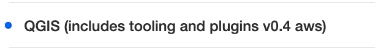
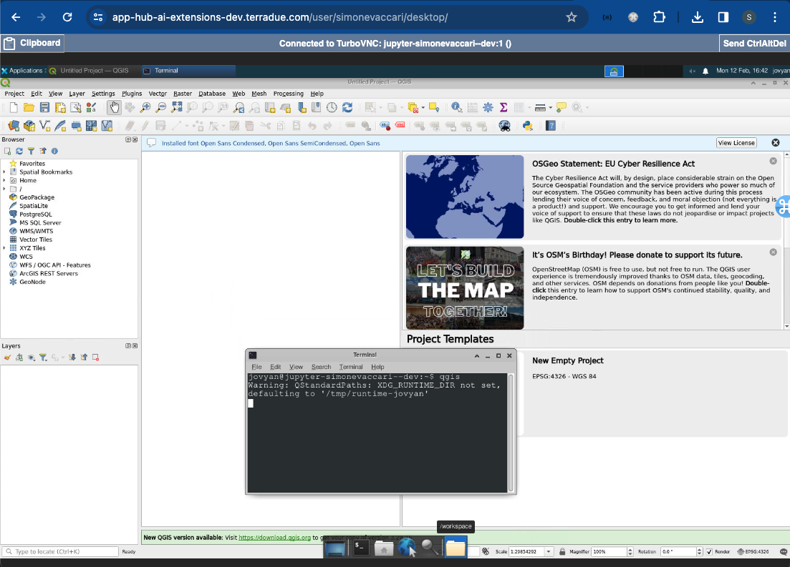

# QGIS

## Introduction
Our service incorporates QGIS Remote Desktop, managed by JupyterHub, providing a remote desktop environment with QGIS, a widely-used free and open-source application for viewing, editing, and analysing geo-spatial data. It provides a versatile platform equipped with tools to perform spatial analysis, geoprocessing, visualise geospatial data, enhancing their labelling and analysis tasks. This integration empowers AI-users to leverage QGIS's extensive capabilities directly from their web browser for making informed decisions based on geographic data.

The following outlines the specific ways in which QGIS supports AI-users's labelling tasks within the service:

* Geospatial Data Exploration: QGIS allows AI-users to load and explore various types of geospatial data within the remote desktop environment. They can import satellite imagery, aerial photographs, vector data, and other geospatial datasets. QGIS provides a user-friendly interface to navigate and zoom in on specific areas of interest, enabling AI-users to closely examine the data they need to label.
* Labelling Tools and Annotations: QGIS offers a range of tools and functionalities specifically designed for labelling tasks. AI-users can leverage QGIS's labelling tools to create annotations such as points, lines, polygons, or complex geometries directly on the geospatial data. They can assign labels, attributes, or other relevant information to these annotations, facilitating the labelling process.
* Attribute Editing: QGIS allows AI-users to edit the attributes associated with geospatial features. This feature is particularly useful when labelling tasks involve updating or modifying existing attribute values. AI-users can easily access and edit attribute tables within QGIS, ensuring accurate and consistent labelling of geospatial data.
* Advanced Labelling Options: QGIS provides advanced labelling options to enhance the visual representation of labelled data. AI-users can configure labelling styles, such as font size, colour, and placement, to ensure readability and clarity of the labels. QGIS also supports labelling rules based on specific conditions or attribute values, allowing for automated labelling of geospatial features.
* Quality Control and Validation: QGIS offers tools for quality control and validation of labelled data. AI-users can use QGIS to review and verify the accuracy and consistency of labels by comparing them with reference data or applying predefined validation rules. This helps ensure the high quality of the labelled dataset.
* Integration with Existing Workflows: QGIS can be seamlessly integrated into AI-users's existing labelling workflows. They can import and export labelled data in various formats, making it compatible with other tools or systems. QGIS's flexibility allows AI-users to incorporate the labelled data generated within the remote desktop environment into her broader analysis pipelines or downstream applications.

By leveraging QGIS in the remote desktop environment, AI-users gains access to a comprehensive labelling toolset specifically tailored for geospatial data. QGIS's geospatial data exploration capabilities, labelling tools, attribute editing features, advanced labelling options, quality control functionalities, and integration capabilities ensure efficient and accurate labelling tasks.

## Starting QGIS
The QGIS-dedicated platform can be launched from the JupyterHub dashboard login page. When asked which Server Option to launch, select "**QGIS (includes tooling and plugings v0.4 aws)**" and then `Start` to launch it. 

QGIS can then be launched by opening a terminal, typing `qgis` and executing it. The QGIS window will be displayed.

More documentation on QGIS can be found on the official webpage (https://www.qgis.org/)[https://www.qgis.org/]. 