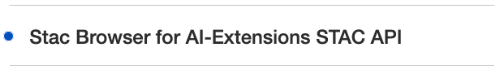
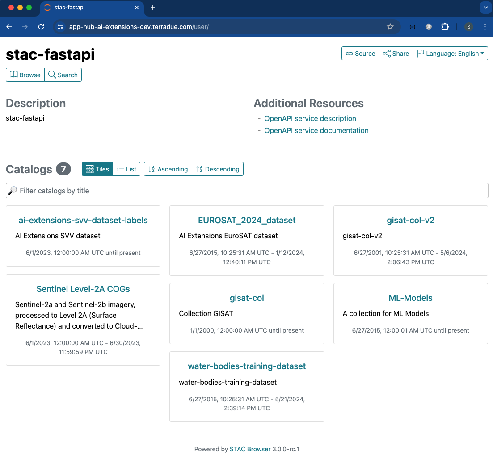

# STAC API

## Introduction
The SpatioTemporal Asset Catalog (STAC) is a powerful standard for describing geospatial data, so it can be more easily worked with, indexed, discovered and shared. As part of the Application Hub, the system integrates the **STAC Browser**, which allows AI-users to discover and explore EO data and training datasets. The STAC Browser supports easy search and retrieval of relevant EO data through the STAC standard, enabling efficient data discovery and selection for ML tasks.

The STAC Browser enhances AI-users's workflows by providing a user-friendly interface for browsing and exploring the available EO data and training datasets. The following highlights the key features and benefits of using the STAC Browser to support AI-users scenarios:

* User-Friendly Data Exploration: The STAC Browser provides AI-users with an intuitive and user-friendly interface to explore and discover available EO data and training datasets. Through the browser's interface, AI-users can navigate through different catalog layers, filter data based on various criteria such as location, time range, and sensor type, and preview metadata associated with each dataset. This streamlines the process of finding relevant data for her specific tasks.
* Metadata Visualization and Exploration: The STAC Browser allows AI-users to visualise and explore metadata associated with EO data and training datasets. They can view essential information such as acquisition dates, sensor specifications, data formats, and available assets within each dataset. The browser may also provide interactive visualisations, such as maps or charts, to help AI-users gain insights into the spatial and temporal characteristics of the data.
* Advanced Search and Filtering: The STAC Browser supports advanced search and filtering capabilities, enabling AI-users to narrow down her search based on specific criteria. They can apply filters based on geographic extent, temporal range, data source, and other relevant metadata attributes. This helps AI-users quickly locate the data and training datasets that align with her specific needs, saving time and effort in the data discovery process.
* Dataset Previews and Samples: The STAC Browser allows AI-users to preview sample images or data subsets from the available datasets. This preview functionality gives her a glimpse of the data content, allowing her to assess the suitability of the datasets for her tasks. It enables quick visual inspection to verify if the data aligns with her requirements before proceeding with further processing or integration into her workflows.
* Integration with STAC and STAC API: The STAC Browser seamlessly integrates with the STAC standard and STAC API, providing a unified experience for data discovery. It leverages the underlying STAC metadata and data catalog structure to present a comprehensive view of available EO data and training datasets. The browser may interact with the STAC API to fetch the relevant metadata and facilitate efficient data access and retrieval.

By incorporating a STAC Browser into the service, AI-users gain a powerful tool for EO data and training datasets discovery. The browser's user-friendly interface, advanced search capabilities, and metadata visualisation features simplify the process of finding and exploring relevant data. This enables AI-users to efficiently identify and select the data necessary for her training datasets and other ML workflows.

A dedicated article entitled [**Discovering Labelled EO Data with STAC**](https://discuss.terradue.com/t/announcing-the-launch-of-the-ai-ml-enhancement-project-for-gep-and-urban-tep-exploitation-platforms/1188/7#aiml-enhancement-project-discovering-labelled-eo-data-with-stac-1) describes comprehensively how to exploit the STAC format to discover labelled EO data.

## Starting STAC Browser
The STAC Browser app can be launched at login with the option "**STAC Browser for AI-Extensions STAC API**".



After login, the STAC Browser dashboard will appear, showing the existing collections, which you can browse and visualise. 



## Accessing via STAC API endpoint
The dedicated STAC API endpoint can also be accessed via Jupyter Notebook by providing the appropriate authorisation `headers`. 

```
payload = {
    "client_id": "ai-extensions",
    "username": "ai-extensions-user",
    "password": os.environ.get("IAM_PASSWORD"),
    "grant_type": "password",
}

token = get_token(url=os.environ.get("IAM_URL"), **payload)
del(payload)
headers = {"Authorization": f"Bearer {token}"}

cat = Client.open("https://ai-extensions-stac.terradue.com", headers=headers, ignore_conformance=True)
```
To show the available collections in the Catalog.
```
[c for c in cat.get_collections()]

[<CollectionClient id=ai-extensions-svv-dataset-labels>,
 <CollectionClient id=sentinel-s2-l2a-cogs>,
 <CollectionClient id=EUROSAT_2024_dataset>,
 <CollectionClient id=gisat-col>]
```