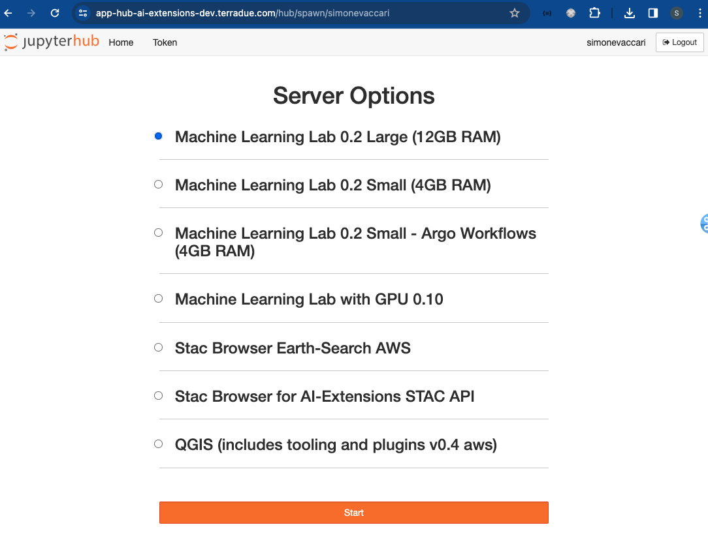

# JupyterHub
JupyterHub is a dedicated multi-user server that brings the power of JupyterLab to collaborative environments. It allows organizations to effortlessly deploy and manage Jupyter Notebook servers for multiple users, enabling seamless collaboration and resource sharing in data science and research settings. 

After login on your dedicated App Hub instance (e.g. [https://app-hub-ai-extensions-dev.terradue.com/](https://app-hub-ai-extensions-dev.terradue.com/)), you will be given the choice between different server options. These options are user-specific and depend on your registration profile settings. 

In the example shown below, seven server options are available: 

JupyterHub acts as a central platform, facilitating the launching and management of applications, providing a seamless and integrated experience for our users. Various web applications such as **MLflow**, **JupyterLab**, **Code Server** are managed and deployed within JupyterHub, which can be launched by selecting either servers with `4GB RAM` and `12GB RAM` availability, below: 

* **Machine Learning Lab X.Y Small (4GB RAM)**
* **Machine Learning Lab X.Y Large (12GB RAM)**

Dedicated instances for other applications can be launched with their respective selection and then by clicking on `Start` to launch them.

* **Machine Learning Lab X.Y Small - Argo Workflows (4GB RAM)**
* **Machine Learning Lab with GPU 0.10**
* **STAC Browseer Earth-Search AWS**
* **STAC Browseer for AI-Extensions STAC-API**
* **QGIS (includes tooling and plugins v0.4 aws)**
