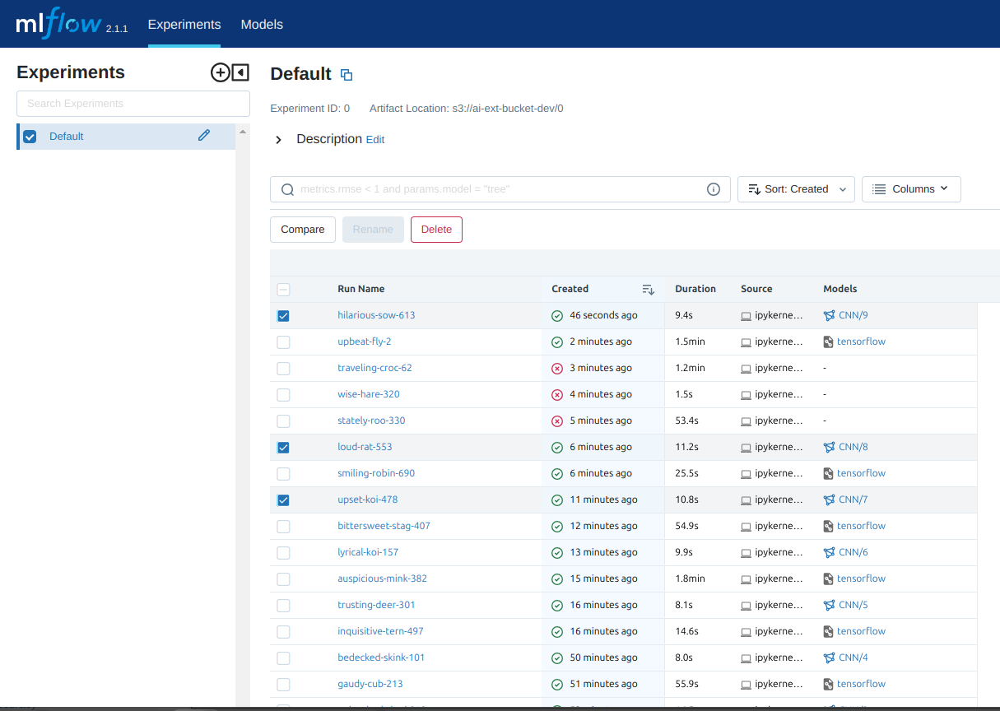

# MLflow

## Introduction
The ML-Lab application integrates with MLflow, an open-source platform for managing the machine learning (ML) lifecycle. MLflow provides tools and functionalities to track experiments, package models, version models, model hyperparameters, packaging code into reproducible runs, deploy models, monitor performance, and enable collaboration among team members. MLflow enables users to effectively organize and monitor their ML projects, enabling collaboration, reproducibility, and streamlined deployment workflows.

The following outlines the specific ways in which MLflow is used within the service:

* Experiment Tracking: The service utilises MLflow's experiment tracking capabilities to record parameters, metrics, and artefacts associated with each machine learning experiment. This enables reproducibility and facilitates comparison between different model configurations.
* Model Packaging: MLflow is used to package trained models in a standardised format. This includes saving the model artefacts, dependencies, and metadata required for deployment. The packaged models are self-contained and can be easily shared or deployed in various environments.
* Model Versioning: MLflow's versioning functionality is leveraged to manage different versions of trained models. This allows for tracking the evolution of models over time, comparing different versions, and ensuring reproducibility. It also facilitates collaboration among team members working on the same project.
* Integration with Existing Tools: MLflow integrates with popular machine learning tools and frameworks such as `TensorFlow`, `PyTorch`, and `scikit-learn`. This allows seamless integration of MLflow's tracking and management capabilities within the existing machine learning workflow, enhancing productivity and compatibility.

By incorporating MLflow into the ML-Lab application, we ensure proper management, tracking, packaging, versioning, deployment, monitoring, and collaboration throughout the machine learning lifecycle. This enables efficient development, deployment, and maintenance of machine learning models within the service.

## Starting MLflow

On the JupyterLab dashboard, click on the `mlflow` Logo.

The `MLflow` dashboard will appear.

## Practical Examples

Below are a few examples of using `MLflow` in a ML project workflow:
* The user can select one or multiple runs to **Compare**

* The user can see a quick overview of each run and select which parameter(s) to analyse and plot on the graph

* The user compares different parameteres fed to the CNN model

* The user compares evaluation metrics of each run, to opt for the best model for his/her application. 

