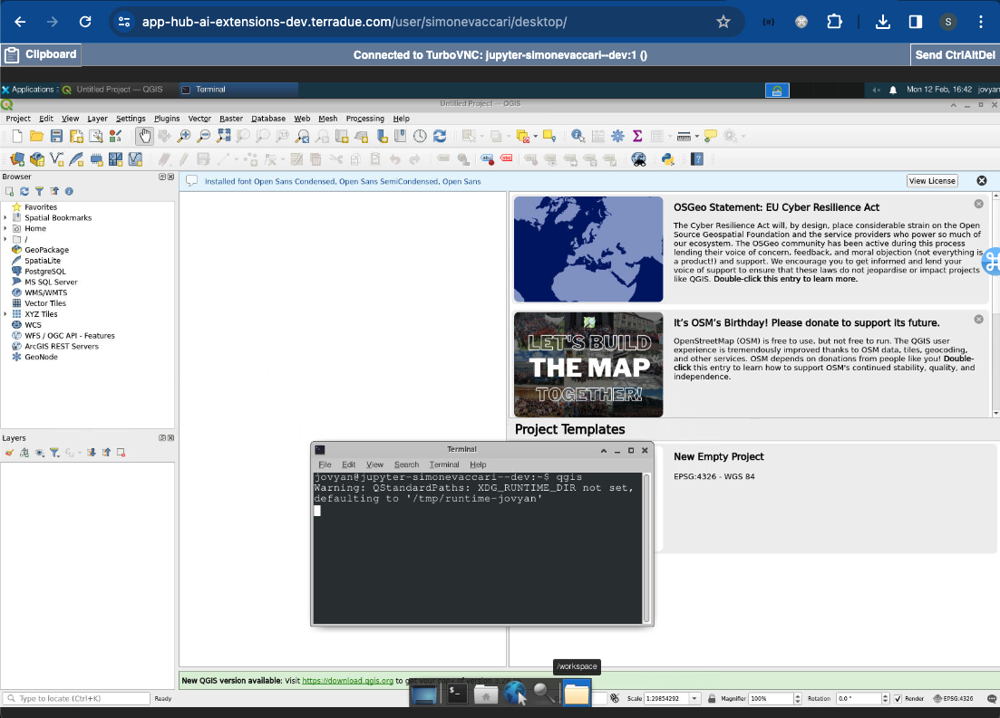

# QGIS
QGIS is a free and open-source application for viewing, editing, and analysing geo-spatial data. It provides a versatile platform equipped with tools for spatial analysis, geoprocessing, and map production, empowering users to make informed decisions based on geographic data. Link to the official documentation: https://qgis.org/it/site/. 

The QGIS-dedicated platform can be launched from the JupyterHub dashboard login page. When asked which Server Option to launch, select "**QGIS (includes tooling and plugings v0.4 aws)**" and then Start to launch it. 

block; margin: 20 auto;"/>

QGIS can then be launched by opening a terminal, typing `qgis` and executing it. The QGIS window will be displayed.

block; margin: 20 auto;"/>

