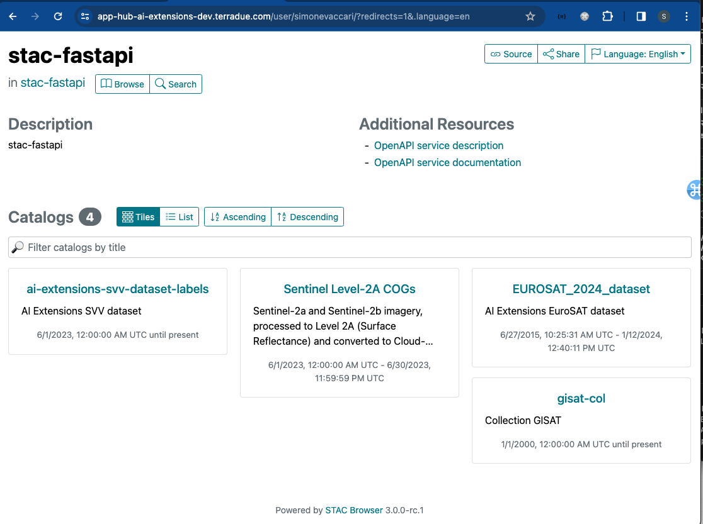

# Connection to STAC API
The SpatioTemporal Asset Catalog (STAC) is a powerful standard for describing geospatial data, so it can be more easily worked with, indexed, discovered and shared. Link to the official documentation: https://stacspec.org/en. 

The dedicated STAC Browser app can be launched at login with the option "**STAC Browser for AI-Extensions STAC API**".


After login, the STAC Browser dashboard will appear, showing the existing collections, which you can browse and visualise. 



The dedicated STAC API endpoint can also be accessed via Jupyter Notebook by providing the appropriate authorisation `headers`. 

```
payload = {
    "client_id": "ai-extensions",
    "username": "ai-extensions-user",
    "password": os.environ.get("IAM_PASSWORD"),
    "grant_type": "password",
}

token = get_token(url=os.environ.get("IAM_URL"), **payload)
del(payload)
headers = {"Authorization": f"Bearer {token}"}

cat = Client.open("https://ai-extensions-stac.terradue.com", headers=headers, ignore_conformance=True)
```
To show the available collections in the Catalog.
```
[c for c in cat.get_collections()]

[<CollectionClient id=ai-extensions-svv-dataset-labels>,
 <CollectionClient id=sentinel-s2-l2a-cogs>,
 <CollectionClient id=EUROSAT_2024_dataset>,
 <CollectionClient id=gisat-col>]
```