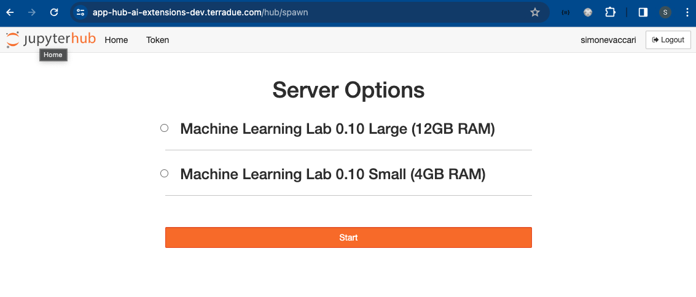

# AI-Extension Application Hub - User Manual 

## Purpose

This is the text of the first section 

## Registration

* App Hub url: [https://app-hub-ai-extensions-dev.terradue.com/](https://app-hub-ai-extensions-dev.terradue.com/)
* User Registration
* Dashboard


## Applications
### JupyterLab
After loading up, the JupyterLab dashboard will appear.


### Code Server
On the JupyterLab dashboard, click on the Code Server Logo.

The Code Server dashboard will appear.


### ML-Flow
On the JupyterLab dashboard, click on the ML-Flow Logo.

The ML-Flow dashboard will appear.


### QGIS

## Functionalities 
### Access to AWS s3
A dedicated Amazon S3 storage is pre-configured to be accessed from the App Hub. This can be done with the Amazon Web Server (AWS) `aws s3` commands in the AWS CLI.

For example, to list the content of a specific S3 bucket, you can use the command below.
```
aws s3 ls <bucket_name>
```
Other examples with full syntax on using the `aws s3` command are described in the official [AWS website](https://docs.aws.amazon.com/cli/latest/userguide/cli-services-s3-commands.html).
