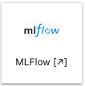
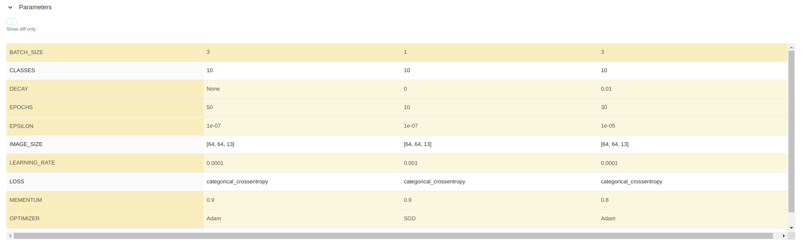

# AI-Extension Application Hub - User Manual 

## Purpose

The AI-Extensions project aims at supporting the Earth Science and Services Communities by expanding the existing Earth Observation (EO) platform offerings services with operationally mature AI/ML software capabilities. This is achieved through the AI-Extension Application Hub, a dedicated Cloud platform that provides the integration and operational implementation of EO and AI capabilities.  

This User Manual provides a guideline, as well as step-by-step instructions, for developers and consumers to effectively leverage the AI-Extension Application Hub. 

## Registration

* App Hub URL: [https://app-hub-ai-extensions-dev.terradue.com/](https://app-hub-ai-extensions-dev.terradue.com/)
* User Registration: *add steps*
* JupyterHub - Server Options: different options can be configured for your username. These will be visible on the JupyterHub dashboard after login. In the example shown below, two server options are available. You can click on one (e.g. "**Machine Learning Lab 0.10 Large (12GB RAM)**") and click on `Start` to launch it. 

<p align="center" ></p>
## Applications
### JupyterLab
After loading up, the JupyterLab dashboard will appear.

<p align="center" ></p>

### Code Server
On the JupyterLab dashboard, click on the Code Server Logo.

<p align="center" ></p>

The Code Server dashboard will appear.

<p align="center" ></p>

### ML-Flow
On the JupyterLab dashboard, click on the ML-Flow Logo.

<p align="center" ></p>

The ML-Flow dashboard will appear.

<p align="center" ></p>

> Example of using mlflow in a Machine learning project:
>
>- The user select some runs for comparision and click on **Compare**
>
><p align="center" >block; margin: 20 auto;"/></p>
>
> - The user can see a quick overview of each run.
>
> <p align="center" >block; margin: 20 auto;"/></p>
>        
>- The user compare diferent parameteres fed to the CNN model.
>
><p align="center" >block; margin: 20 auto;"/></p> 
>
>- The user compare evaluation metrics to opt the best model for his/her application. 
>
><p align="center" >display: >block; margin: 20 auto;"/></p>        


### QGIS

## Functionalities 
### Connection to STAC API
A dedicated STAC API endpoint was configured and can be access from the App Hub by providing the appropriate authorisation `headers`. 
```
cat = Client.open("https://ai-extensions-stac.terradue.com", headers=headers, ignore_conformance=True)
```
To show the available collections in the Catalog.
```
[c for c in cat.get_collections()]

[<CollectionClient id=ai-extensions-svv-dataset-labels>,
 <CollectionClient id=sentinel-s2-l2a-cogs>,
 <CollectionClient id=EUROSAT_2024_dataset>,
 <CollectionClient id=gisat-col>]
```

### Access to AWS s3
A dedicated Amazon S3 storage is pre-configured to be accessed from the App Hub. This can be done with the Amazon Web Server (AWS) `aws s3` commands in the AWS CLI.

For example, to list the content of a specific S3 bucket, you can use the command below.
```
aws s3 ls <bucket_name>
```
Other examples with full syntax on using the `aws s3` command are described in the official [AWS website](https://docs.aws.amazon.com/cli/latest/userguide/cli-services-s3-commands.html).