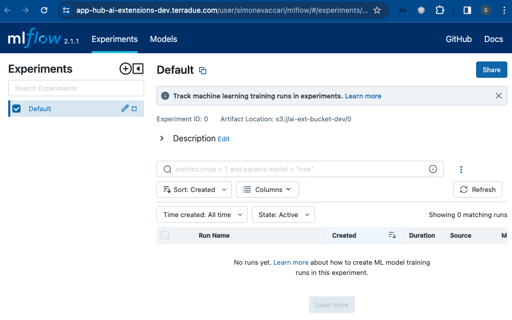

# AI-Extension Application Hub - User Manual 

## Purpose

The AI-Extensions project aims at supporting the Earth Science and Services Communities by expanding the existing Earth Observation (EO) platform offerings services with operationally mature AI/ML software capabilities. This is achieved through the AI-Extension Application Hub, a dedicated Cloud platform that provides the integration and operational implementation of EO and AI capabilities.  

This User Manual provides a guideline, as well as step-by-step instructions, for developers and consumers to effectively leverage the AI-Extension Application Hub. 

## Registration

* App Hub URL: [https://app-hub-ai-extensions-dev.terradue.com/](https://app-hub-ai-extensions-dev.terradue.com/)
* User Registration: *add steps - link to configuration.md file?!*
* JupyterHub - Server Options: different server options can be configured for your username. These will be visible on the JupyterHub dashboard after login. In the example shown below, a few server options are available. You can select one (e.g. "**Machine Learning Lab 0.10 Large (12GB RAM)**") and then click on `Start` to launch it. 

<p align="left" ></p>


## Applications

### JupyterLab
JupyterLab is an interactive development environment that enables users to create and share documents that contain live code, visualisation and other content. With its flexible and extensible architecture, JupyterLab provides a seamless interface for data science workflows, allowing users to explore, analyze, and collaborate on data-driven projects effortlessly. 
Link to the official documentation: https://jupyter.org/. 

After loading up, the JupyterLab dashboard will appear. 

<p align="left" ></p>

### Code Server
Code Server enables the user to run Visual Studio Code (VS Code), a lightweight and versatile source code editor that combines the simplicity of a text editor with powerful developer tools, providing an intuitive and customizable environment for coding across various programming languages. With Code Server, VS Code and all its functionalities are available directly from the Application Hub server. Link to the official documentation: https://code.visualstudio.com/docs/remote/vscode-server. 

On the JupyterLab dashboard, click on the Code Server Logo.

<p align="left" ></p>

The Code Server dashboard will appear.

<p align="left" ></p>

You have access of all these functionalities from the vertical panel in the top-left corner of the dashboard:
* **Menu**: access functions and settings within VS Code
* **Explore**: navigate and manage files and directories in your workspace 
* **Search**: find specific files, text, or symbols within your workspace
* **Source Control**: manage version control system such as Git directly within VS Code
* **Run and Debug**: execute and debug code with built-in tools
* **Extensions**: enhance functionality by installing and managing extensions to support the development workflow 
* **Test**: run tests and view test outptus 

### ML-Flow
`MLflow` is a powerful open-source platform that simplifies the end-to-end machine learning (ML) lifecycle management. It provides tools for tracking experiments, model hyperparameters, packaging code into reproducible runs, and sharing and deploying models across different environments seamlessly. `MLflow` enables users to effectively organize and monitor their ML projects, enabling collaboration, reproducibility, and streamlined deployment workflows. Link to the official documentation: https://mlflow.org/.

On the JupyterLab dashboard, click on the `mlflow` Logo.

<p align="left" ></p>

The `MLflow` dashboard will appear.

<p align="left" ></p>

Below are a few examples of using `MLflow` in a ML project workflow:
* The user can select one or multiple runs to **Compare**

<p align="left" >block; margin: 20 auto;"/></p>

* The user can see a quick overview of each run and select which parameter(s) to analyse and plot on the graph

<p align="left" >block; margin: 20 auto;"/></p>
       
* The user compares different parameteres fed to the CNN model

<p align="left" >block; margin: 20 auto;"/></p> 

* The user compares evaluation metrics of each run, to opt for the best model for his/her application. 

<p align="left" >display: >block; margin: 20 auto;"/></p>        

### QGIS
QGIS is a free and open-source application for viewing, editing, and analysing geo-spatial data. It provides a versatile platform equipped with tools for spatial analysis, geoprocessing, and map production, empowering users to make informed decisions based on geographic data. Link to the official documentation: https://qgis.org/it/site/. 

The QGIS-dedicated platform can be launched from the JupyterHub dashboard login page. When asked which Server Option to launch, select "**QGIS (includes tooling and plugings v0.4 aws)**" and then Start to launch it. 

<p align="left" >block; margin: 20 auto;"/></p>

QGIS can then be launched by opening a terminal, typing `qgis` and executing it. The QGIS window will be displayed.
<p align="left" >block; margin: 20 auto;"/></p>


## Functionalities 
### Connection to STAC API
The SpatioTemporal Asset Catalog (STAC) is a powerful standard for describing geospatial data, so it can be more easily worked with, indexed, discovered and shared. Link to the official documentation: https://stacspec.org/en. 

The dedicated STAC Browser app can be launched at login with the option "**STAC Browser for AI-Extensions STAC API**".

<p align="left" >block; margin: 20 auto;"/></p>

After login, the STAC Browser dashboard will appear, showing the existing collections, which you can browse and visualise. 

<p align="left" >block; margin: 20 auto;"/></p>

The dedicated STAC API endpoint can also be accessed via Jupyter Notebook by providing the appropriate authorisation `headers`. 

```
payload = {
    "client_id": "ai-extensions",
    "username": "ai-extensions-user",
    "password": os.environ.get("IAM_PASSWORD"),
    "grant_type": "password",
}

token = get_token(url=os.environ.get("IAM_URL"), **payload)
del(payload)
headers = {"Authorization": f"Bearer {token}"}

cat = Client.open("https://ai-extensions-stac.terradue.com", headers=headers, ignore_conformance=True)
```
To show the available collections in the Catalog.
```
[c for c in cat.get_collections()]

[<CollectionClient id=ai-extensions-svv-dataset-labels>,
 <CollectionClient id=sentinel-s2-l2a-cogs>,
 <CollectionClient id=EUROSAT_2024_dataset>,
 <CollectionClient id=gisat-col>]
```

### Access to AWS s3
A dedicated Amazon S3 storage is pre-configured to be accessed from the App Hub. This can be done with the Amazon Web Server (AWS) `aws s3` commands in the AWS CLI.

For example, to list the content of a specific S3 bucket, you can use the command below.
```
aws s3 ls <bucket_name>
```
Other examples with full syntax on using the `aws s3` command are described in the official [AWS website](https://docs.aws.amazon.com/cli/latest/userguide/cli-services-s3-commands.html).