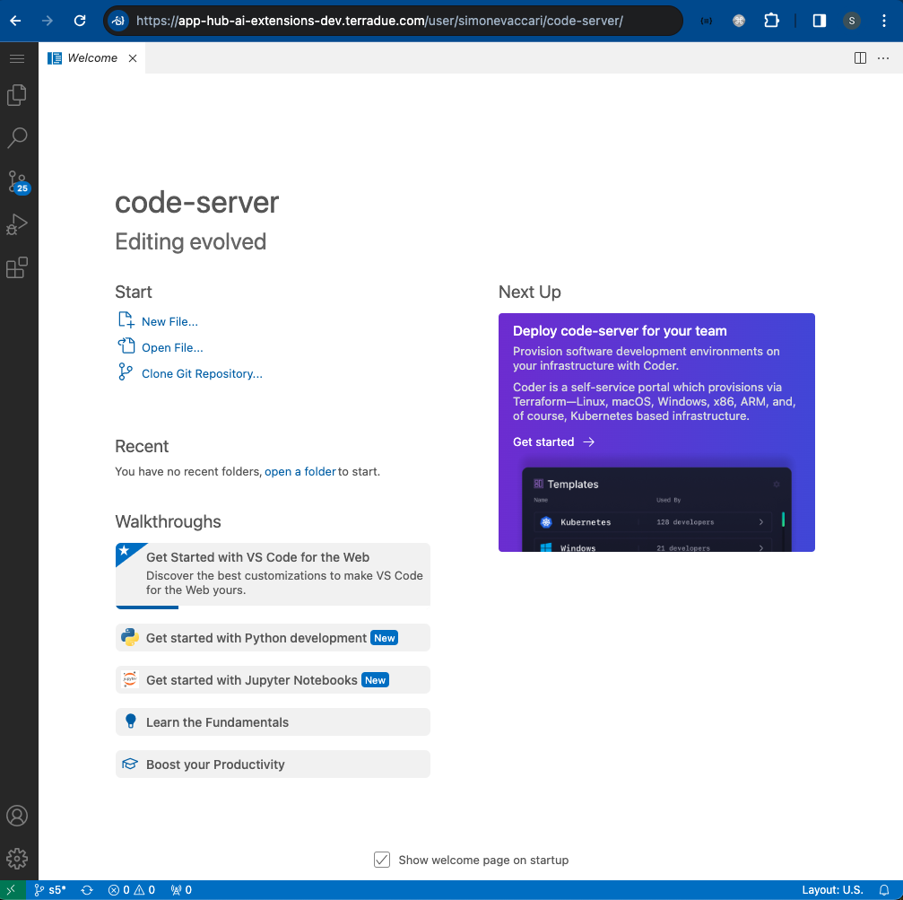

# Code Server
Code Server enables the user to run Visual Studio Code (VS Code), a lightweight and versatile source code editor that combines the simplicity of a text editor with powerful developer tools, providing an intuitive and customizable environment for coding across various programming languages. With Code Server, VS Code and all its functionalities are available directly from the Application Hub server. Link to the official documentation: https://code.visualstudio.com/docs/remote/vscode-server. 

On the JupyterLab dashboard, click on the Code Server Logo.

The Code Server dashboard will appear.

You have access of all these functionalities from the vertical panel in the top-left corner of the dashboard:
* **Menu**: access functions and settings within VS Code
* **Explore**: navigate and manage files and directories in your workspace 
* **Search**: find specific files, text, or symbols within your workspace
* **Source Control**: manage version control system such as Git directly within VS Code
* **Run and Debug**: execute and debug code with built-in tools
* **Extensions**: enhance functionality by installing and managing extensions to support the development workflow 
* **Test**: run tests and view test outptus 