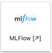
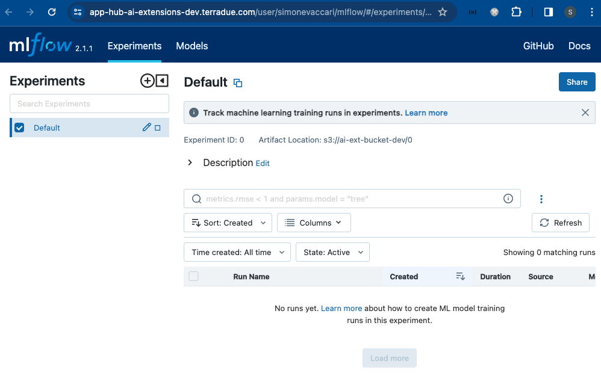
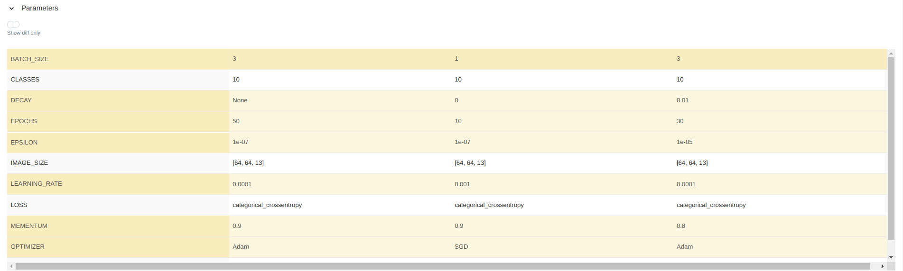
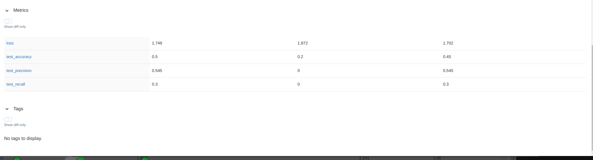

# ML-Flow
`MLflow` is a powerful open-source platform that simplifies the end-to-end machine learning (ML) lifecycle management. It provides tools for tracking experiments, model hyperparameters, packaging code into reproducible runs, and sharing and deploying models across different environments seamlessly. `MLflow` enables users to effectively organize and monitor their ML projects, enabling collaboration, reproducibility, and streamlined deployment workflows. Link to the official documentation: https://mlflow.org/.

On the JupyterLab dashboard, click on the `mlflow` Logo.

The `MLflow` dashboard will appear.

Below are a few examples of using `MLflow` in a ML project workflow:
* The user can select one or multiple runs to **Compare**

* The user can see a quick overview of each run and select which parameter(s) to analyse and plot on the graph

* The user compares different parameteres fed to the CNN model

* The user compares evaluation metrics of each run, to opt for the best model for his/her application. 

